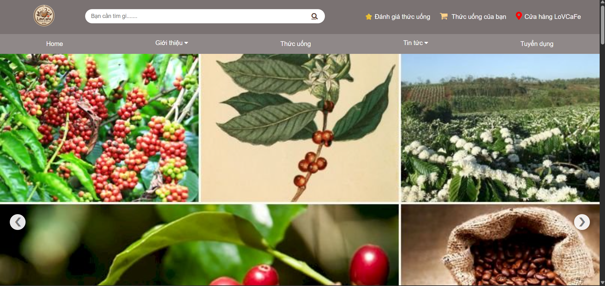
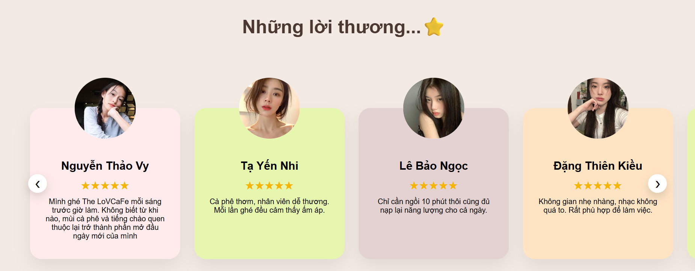
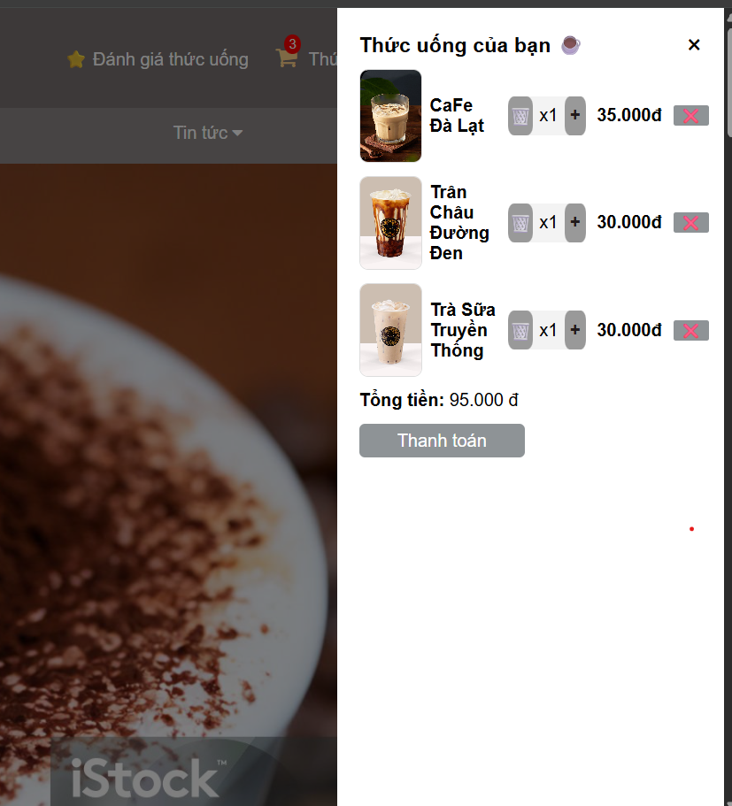

# LoVCafe Website ☕

## 📌 Giới thiệu
Website bán cà phê với giao diện hiện đại, responsive và có chức năng giỏ hàng.

## 🚀 Demo
Link: [https://your-demo-link](https://lov-cafe.vercel.app/)

## 🛠 Công nghệ sử dụng
- HTML5
- CSS3 (Flexbox, Grid)
- JavaScript (DOM, LocalStorage)

## ✨ Chức năng
- Hiển thị sản phẩm theo danh mục
- Tăng giảm số lượng
- Giỏ hàng lưu LocalStorage
- Responsive mobile
- Chi tiết sản phẩm, giới thiệu,...

## 📷 Screenshots

## 👤 Tác giả
Lộc Lê Ngô Văn
